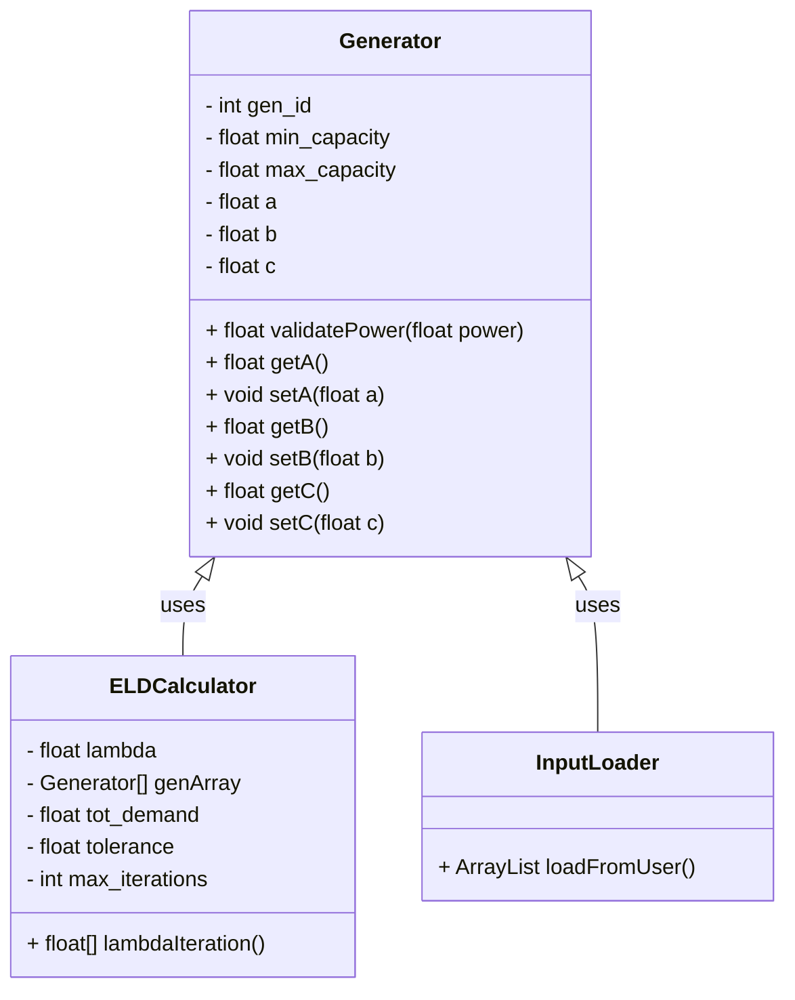

 

# ⚡ ELD Console Simulator {#mainpage}

Welcome to the documentation for the Economic Load Dispatch (ELD) Java console app.  
This tool models generator cost functions and dispatch logic for power systems.

## Equations

$$
P_i = \frac{lambda - b_i}{2*c_i}
$$

## Class diagram

## Documentation
[View code documentation](./docs/html/index.html)

