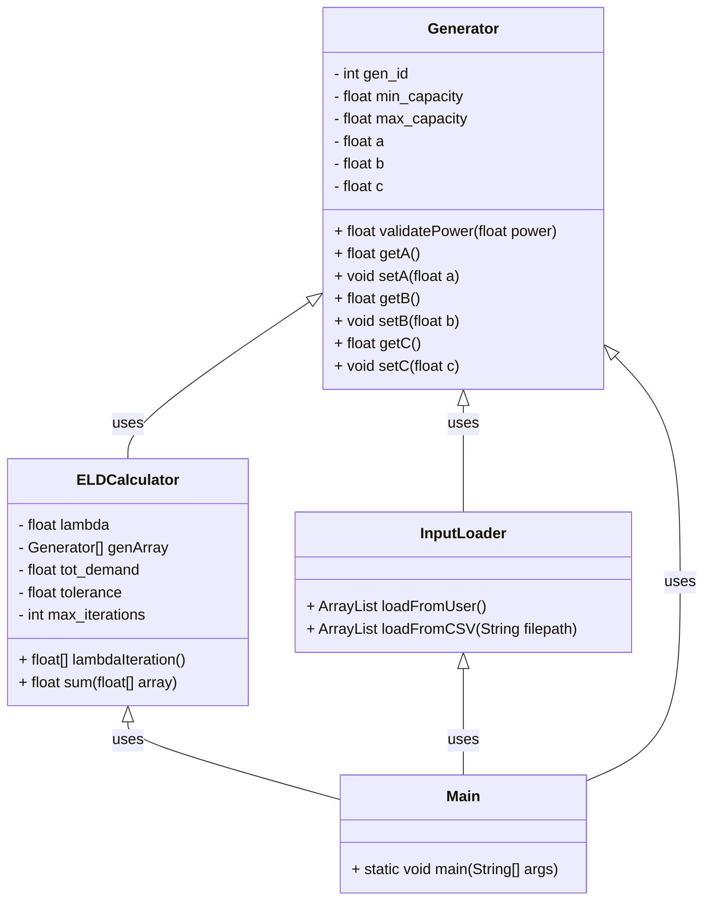

 

# ⚡ ELD Console Simulator {#mainpage}

Welcome to the documentation for the Economic Load Dispatch (ELD) Java console app.  
This tool models generator cost functions and dispatch logic for power systems.

## Equations
Power at each generator,
> $$
P_i = \frac{lambda - b_i}{2*c_i}
$$

Total generated power,
> $$
\sum_{i=1}^{n} P_i = P_{\text{total}}
$$

Main condition to be true for lambda iteration to end:
> $$
P_{\text{total}} + P_{\text{tolerance}} >= P_{\text{demand}}
$$
or

> no.of iterations > max_iterations

## Class diagram

## Documentation
[View code documentation](./docs/html/classes.html)

## References
1. [IEEE 10-GENERATOR 39-BUS SYSTEM](https://www.researchgate.net/file.PostFileLoader.html?id=55019916f079ed153f8b4598&assetKey=AS:273740330405917@1442276188879)
2. Saadat, Power System Analysis, 3rd ed. Maple Valley, WA: PSA Publishing, 2010.