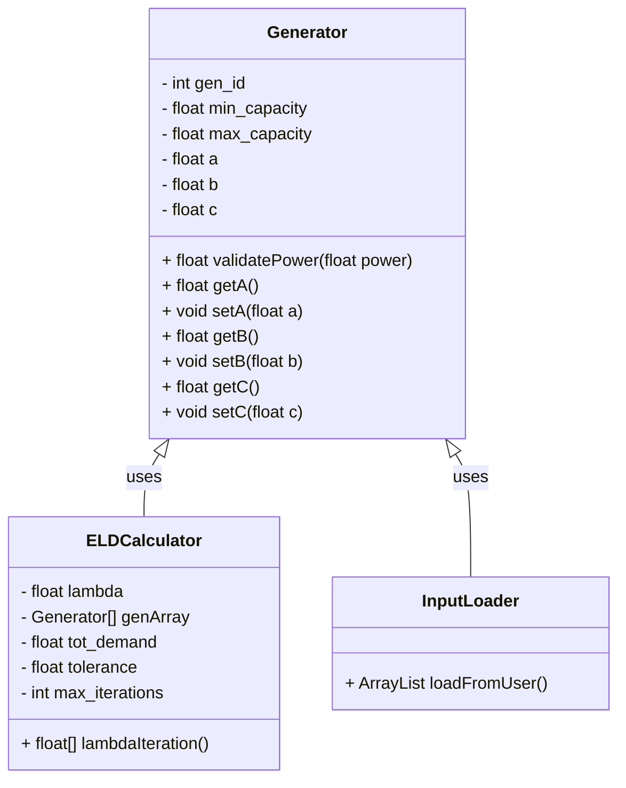

# ELD Console based App{#mainpage}

## Class diagram

```mermaid
classDiagram
    class Generator {
        - int gen_id
        - float min_capacity
        - float max_capacity
        - float a
        - float b
        - float c
        + float validatePower(float power)
        + float getA()
        + void setA(float a)
        + float getB()
        + void setB(float b)
        + float getC()
        + void setC(float c)
    }
    
    class InputLoader{
        + ArrayList<Generator> loadFromUser()
    }
    
    class ELDCalculator {
        - float lambda
        - Generator[] genArray
        - float tot_demand
        - float tolerance
        - int max_iterations
        + float[] lambdaIteration()
    }

    Generator <|-- ELDCalculator : uses
    Generator <|-- InputLoader : uses
```
